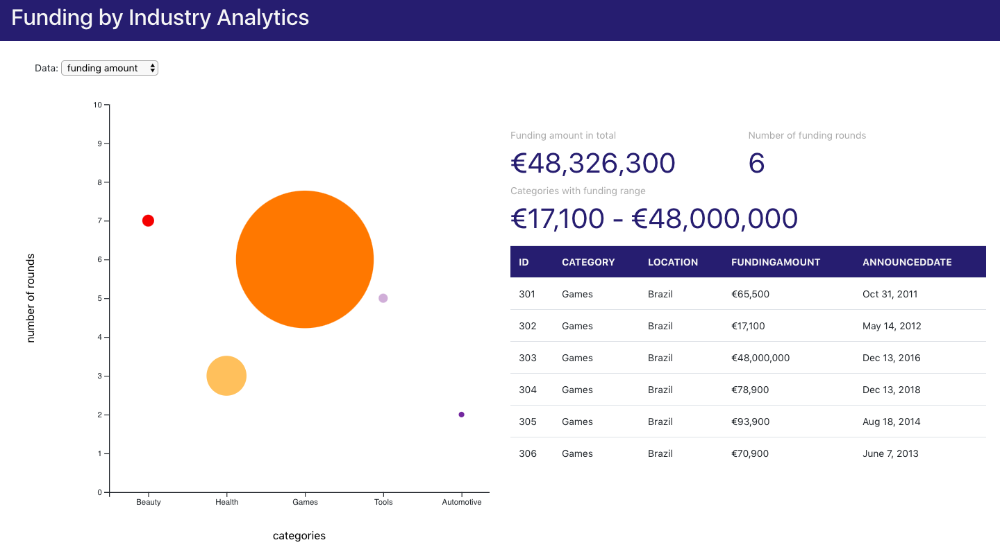

# AtomLeap Technical Assessment

This is an application created by React and D3.js that presents the data visualization of funding volume and number of funding rounds per category.

The x-axis shows the categories, y-axis represents the number of rounds, and the size of the bubble indicates the total funding amount



## How to run the app
You can run the app in the development mode by typing the code below in the terminal:
```
cd fundingviz
npm install
npm start
```

## Note
I completed this assessement in the time limit of 3 hours. Before coding, I created a scratch sheet listing out the subjectives and decisions to make for this project. You can find the scratch sheet [here](https://docs.google.com/document/d/1XcTrJzLXVQvyWnP7jcv6protQ2QRAoEjc4RoObAlUY4/edit?usp=sharing).
